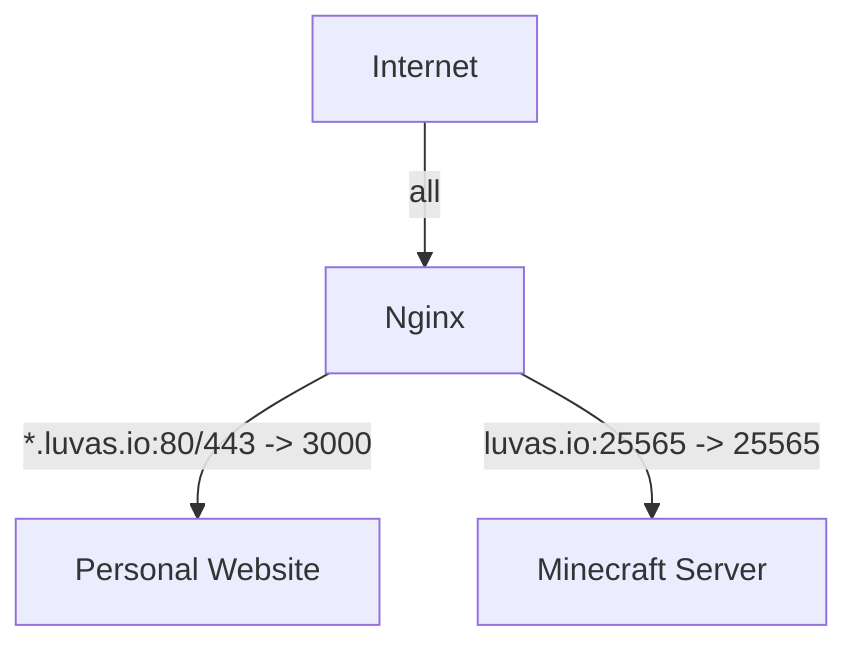

# luvas.io

## Quick Start

Edit `docker-compose.yml` to change:
- SSL_EMAIL: Your email for Let's Encrypt
- SSL_DOMAINS: Domains for SSL certificates
- VERSION: Minecraft version

```bash
# Run everything
docker compose up -d

# Build
docker compose build

# Check logs
docker compose logs

# Stop everything
docker compose down
```

## Services

- **nginx**: Reverse proxy + SSL
- **personal-site**: Angular + Node.js website
https://luvas.io
- **minecraft-server**: A Minecraft server to have fun
luvas.io:25565

## Architecture


